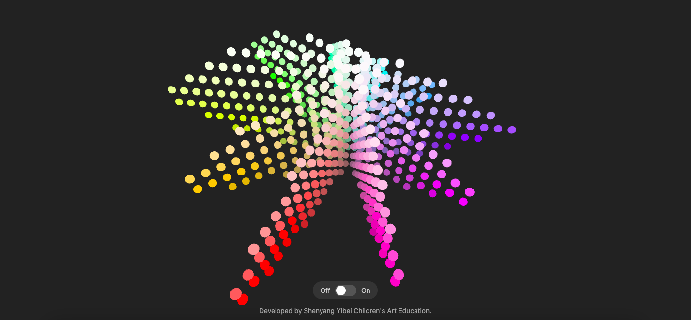

# Munsell 3D Viewer

[](https://fisherv2023.github.io/munsell-3d-viewer/)

An interactive 3D web application built with Three.js to visualize the Munsell color solid. This version has been upgraded to feature **10 main hues** and a **dual-mode viewing system**, providing a richer and more practical tool for artists, designers, and color enthusiasts.

一个基于 Three.js 的交互式3D网页应用，用于可视化孟塞尔色立体。此版本已升级，包含 **10个主色相** 和 **双模式查看系统**，为艺术家、设计师和色彩爱好者提供了一个更丰富、更实用的工具。

---



## 🎨 Live Demo (在线演示)

**[Click here to experience it live »](https://fisherv2023.github.io/munsell-3d-viewer/)**
**[点击这里在线体验 »](https://fisherv2023.github.io/munsell-3d-viewer/)**

## ✨ Features (功能特性)

*   🌟 **Expanded 10-Hue Model**
    Visualizes the 10 main Munsell hues (5R, 5YR, 5Y, etc.) to show a more complete and accurate color solid, clearly illustrating the irregular shape of human color perception.
    
    🌟 **扩展的10色相模型**
    可视化10个孟塞尔主色相（5R, 5YR, 5Y等），展示一个更完整、更准确的色立体，清晰地揭示了人类色彩感知的不规则形状。

*   💡 **Dual-Mode Viewing (3D / Flat)**
    A toggle switch at the bottom allows you to instantly switch between:
    *   **On (3D):** A physically-based view with realistic lighting and shadows to perceive depth and form.
    *   **Off (Flat):** A pure-color view with lighting disabled, perfect for accurate color assessment and study.

    💡 **双模式查看 (3D / Flat)**
    底部的切换开关允许您在两种模式间即时切换：
    *   **On (3D):** 基于物理的视图，拥有逼真的光照和阴影，便于感知深度和形态。
    *   **Off (Flat):** 纯色视图，禁用了光照，非常适合进行精确的颜色评估和学习。

*   👆 **Interactive 3D Controls**
    Freely rotate, pan, and zoom the model using your mouse or touch gestures.
    
    👆 **交互式3D控制**
    使用鼠标或触摸手势自由地旋转、平移和缩放模型。

*   🌈 **Gradient Neutral Axis**
    The central value scale features a smooth black-to-white gradient for a clear visual reference of lightness (Value).
    
    🌈 **渐变中性轴**
    中心明度轴采用平滑的黑到白渐变，为明度（Value）提供了清晰的视觉参考。

*   🌑 **Optimized Dark Theme**
    The dark background minimizes visual interference, allowing for more accurate color perception.

    🌑 **优化的深色主题**
    深色背景最大限度地减少了视觉干扰，使颜色感知更准确。

*   🚀 **Pure Client-Side & Responsive**
    Runs entirely in the browser with no backend required. It automatically adapts to any screen size.

    🚀 **纯客户端与响应式设计**
    完全在浏览器中运行，无需后端。自动适应任何屏幕尺寸。

## 🛠️ Technology Stack (技术栈)

-   **HTML5**
-   **CSS3**
-   **JavaScript (ES Modules)**
-   **Three.js**: The core 3D rendering library.

## 🚀 Getting Started (如何在本地运行)

Since this project uses ES Modules, you cannot open the `index.html` file directly in your browser via the `file://` protocol. You need a local web server.
由于本项目使用了 ES Modules，您不能直接通过 `file://` 协议在浏览器中打开 `index.html` 文件。您需要一个本地 Web 服务器来运行它。

1.  **Clone the repository (克隆仓库)**
    ```bash
    git clone https://github.com/fisherv2023/munsell-3d-viewer.git
    ```

2.  **Navigate to the project directory (进入项目目录)**
    ```bash
    cd munsell-3d-viewer
    ```

3.  **Start a local server (启动本地服务器)** (choose one method / 任选一种方式)

    *   **With Python:** If you have Python 3 installed, run:
        (如果你的电脑安装了 Python 3，请运行：)
        ```bash
        python -m http.server
        ```

    *   **With Node.js:** If you have Node.js, you can use `http-server`:
        (如果你安装了 Node.js，可以安装并使用 `http-server`：)
        ```bash
        npx http-server
        ```

    *   **With VS Code:** Install the [Live Server](https://marketplace.visualstudio.com/items?itemName=ritwickdey.LiveServer) extension. Right-click on `index.html` and choose "Open with Live Server".
        (如果你使用 Visual Studio Code，可以安装 [Live Server](https://marketplace.visualstudio.com/items?itemName=ritwickdey.LiveServer) 插件，然后右键点击 `index.html` 并选择 "Open with Live Server"。)

4.  **Open in your browser (在浏览器中打开)**
    Visit the local address provided by the server (usually `http://localhost:8000`).
    (访问服务器提供的地址，通常是 `http://localhost:8000`。)

## 🤝 Contributing (贡献)

Contributions are welcome! If you have suggestions or find a bug, please feel free to open an [Issue](https://github.com/fisherv2023/munsell-3d-viewer/issues).
欢迎任何形式的贡献！如果你有任何建议或发现 Bug，请随时提交 [Issue](https://github.com/fisherv2023/munsell-3d-viewer/issues)。

## 📜 License (开源协议)

This project is licensed under the [MIT License](./LICENSE).
本项目采用 [MIT License](./LICENSE) 开源协议。

## ❤️ Acknowledgments (致谢)

Developed by **Shenyang Yibei Children's Art Education**.
本项目由 **沈阳艺贝少儿美术教育** 开发。
